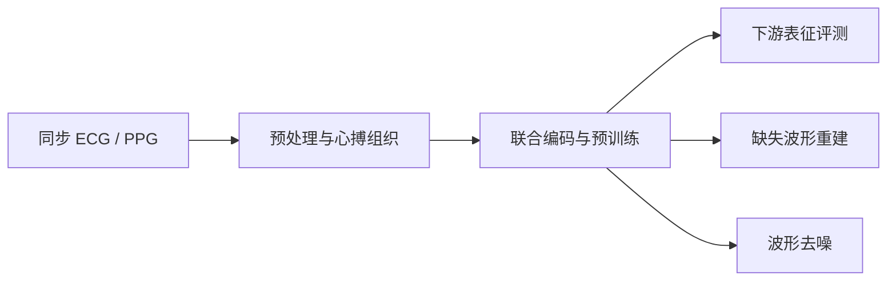

# ECG–PPG Foundation Model · Graduate Thesis

面向心电信号（ECG）与光电容积脉搏波（PPG）的多模态表征学习研究。项目围绕心搏组织、联合编码和预训练，探索生理信号下游评测、缺失波形重建与噪声鲁棒性。

**Research code and archives for joint ECG–PPG representation learning, downstream evaluation, missing-waveform reconstruction, and denoising.**

[浏览模型代码](code/pretraining/ecg_ppg_multitask_pretrain_orthogonal_modality_flexible_merged.py) · [源码导览](code/README.md) · [复现与版本说明](docs/REPRODUCIBILITY.md) · [项目归档](https://github.com/Wally510/graduate-thesis/releases/tag/project-archive-v1) · [模型权重](https://github.com/Wally510/graduate-thesis/releases/tag/model-weights-v1)

## 项目研究什么

ECG 描述心脏电活动，PPG 描述外周脉搏相关的光学变化。本项目研究如何结合两类同步信号，学习可用于多种生理任务的表示，并在信号缺失或受噪声干扰时恢复波形。

公开源码中可以查看以下实现：

- **心搏级数据组织**：信号预处理、心搏切分/重采样、有效心搏掩码与时间信息。
- **ECG–PPG 联合编码**：`PhaseAwareBeatEncoder`、`OrthogonalBeatPhaseBlock`、`CumulativeTimeEncoding` 和 `ReliabilityGatedPooling` 等模块。
- **预训练与下游任务**：打包数据、重建预训练、分布式训练，以及表征提取和下游预测评测。
- **缺失波形重建**：固定遮挡条件下的目标心搏重建与长缺口压力测试。
- **去噪与结果验收**：噪声生成、去噪训练、评测结果聚合和完整性检查。

这些模块的具体配置、输入方式和加载接口随实验版本变化，请结合源码和对应运行记录阅读。



## 直接阅读代码

| 内容 | 入口 | 可以了解什么 |
|---|---|---|
| 模型结构 | [ECGPPGMultiTaskTransformer](code/pretraining/ecg_ppg_multitask_pretrain_orthogonal_modality_flexible_merged.py) | 编码器、心搏/相位注意力、时间编码与汇聚 |
| 数据准备 | [make_dual_view_virtual_r_alignment_pack.py](code/pretraining/make_dual_view_virtual_r_alignment_pack.py) | 双视图数据打包流程 |
| 预训练 | [train_stage2_recon_modality_flexible_packed_ddp.py](code/pretraining/train_stage2_recon_modality_flexible_packed_ddp.py) | Stage 2 重建预训练与 DDP 训练逻辑 |
| 下游评测 | [benchmark_new4_virtual_r.py](code/downstream/benchmark_new4_virtual_r.py) | 数据读取、表征提取、预测头训练与指标计算 |
| 血压任务实现 | [direct_bp_orthogonal_foundation_singlefile.py](code/downstream/direct_bp_orthogonal_foundation_singlefile.py) | 血压数据处理、模型封装和训练流程 |
| 重建评测 | [evaluate_phase8_vtac.py](code/reconstruction/evaluate_phase8_vtac.py) | 固定 target beat 与遮挡条件的外部测试 |
| 长缺口评测 | [evaluate_phase8_vtac_long_gaps.py](code/reconstruction/evaluate_phase8_vtac_long_gaps.py) | 跨心搏、完整心搏和秒级缺口条件 |
| 去噪训练 | [train_denoising.py](code/denoising/train_denoising.py) | 噪声家族、严重度与训练流程 |
| 评测与验收 | [evaluation/](code/evaluation/) | 重建/去噪评测、跨 epoch 汇总与输出检查 |

这次公开了 **17 个研究源码文件和 2 个归档恢复脚本**。它们按用途重新分组，文件内容保持与本地原件一致；[SOURCE_MANIFEST.json](SOURCE_MANIFEST.json) 记录原始位置与 SHA-256，便于回到完整归档中追溯。

## 仓库内容

```text
code/
  pretraining/       模型、数据打包与预训练源码
  downstream/        下游评测和血压任务源码
  reconstruction/    目标心搏与长缺口重建评测
  denoising/         去噪训练及 DDP 公共逻辑
  evaluation/        结果评测、聚合与验收
docs/                复现条件与科学边界
tools/               归档恢复脚本副本
SOURCE_MANIFEST.json 原始路径、文件大小与哈希
```

Git 仓库提供便于浏览的源码选集；完整研究目录、论文材料、实验导出和权重保存在 Releases。克隆仓库不会自动下载这些大附件。

## 下载完整项目与模型权重

| 下载内容 | 链接 | 压缩包 |
|---|---|---|
| 项目、论文材料、实验结果与运行依赖 | [project-archive-v1](https://github.com/Wally510/graduate-thesis/releases/tag/project-archive-v1) | 9 个 ZIP，约 9.50 GiB |
| 模型权重与原路径恢复清单 | [model-weights-v1](https://github.com/Wally510/graduate-thesis/releases/tag/model-weights-v1) | 37 个 ZIP，约 47.56 GiB |

每个下载页均提供 `RESTORE.md`、`SHA256SUMS.txt` 和 `archive-manifest.json`。46 个归档 ZIP 在发布时均已核对 GitHub 与本地的大小和 SHA-256。

1. 下载相应 Release 的**全部 ZIP**，按 `SHA256SUMS.txt` 核验。
2. 将每组 ZIP 解压到同一父目录；项目得到 `First_paper/`，权重得到 `model_weights/`。每个 ZIP 独立可解压，**不要拼接 ZIP**。
3. 如需还原实验脚本使用的原始文件路径，先恢复项目结果，再恢复权重。具体以 Release 的 `RESTORE.md` 为准：

```bash
python First_paper/project_control/FP-90_restore_compacted_project.py --project First_paper --restore
python model_weights/restore_weights.py --project First_paper --restore
```

恢复会将去重和压缩的内容展开，需要额外磁盘空间。应保留清单与完整权重目录，勿单独移动恢复脚本后执行。

## 使用前须知

源码选集用于阅读、审查与二次研究，**不是仅克隆后就能完整复现论文的独立软件包**。训练与评测还依赖对应数据、数据划分、模型权重、外部模块和服务器路径；具体缺口见[复现说明](docs/REPRODUCIBILITY.md)。本次发布进行了 Python 语法、文件一致性和常见凭据模式检查，没有重新训练或运行完整科学实验。

完整归档保留历史版本、调试输出与后续探索代码。代码存在不代表相关实验完成；README 不将不同版本任务数、不同评测协议或探索性结果合并成统一性能结论。尤其需要区分原始 ep14 backbone、重建/去噪适配模型，以及训练消融与推理时干预。

## 许可与交流

目前未为整个仓库声明统一的开源许可证。公开可读不等于授予任意再分发或商业使用权限；第三方代码、模型和数据仍遵循各自条件。引用具体实验时，请同时注明运行版本、checkpoint、数据划分和指标定义。

欢迎通过 [Issues](https://github.com/Wally510/graduate-thesis/issues) 反馈问题，请附上代码路径、归档版本与可复现的错误信息。
